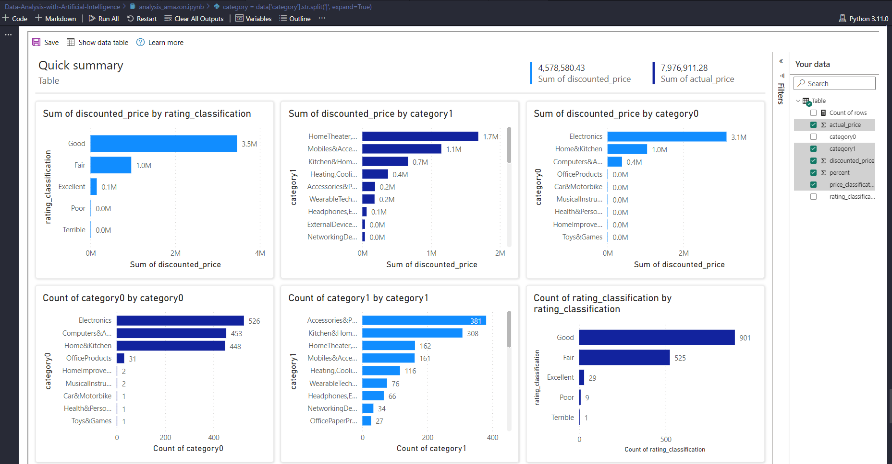
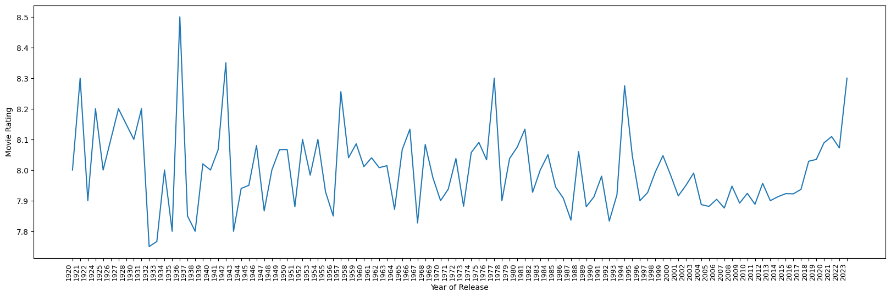

**EDA - Exploratory data analysis**

**Power BI in Python**

**-- AMAZON DATA**

**-- IMDB DATA**

**This result is very interesting!**

The movie quality is decreasing over time; on the other hand, the gross earnings are increasing.

**-- MUNNAR HOTELS DATA**

